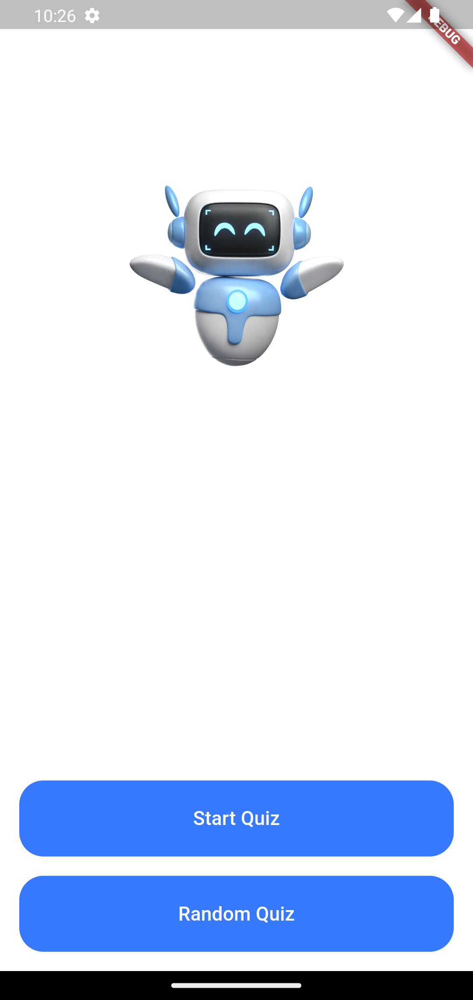
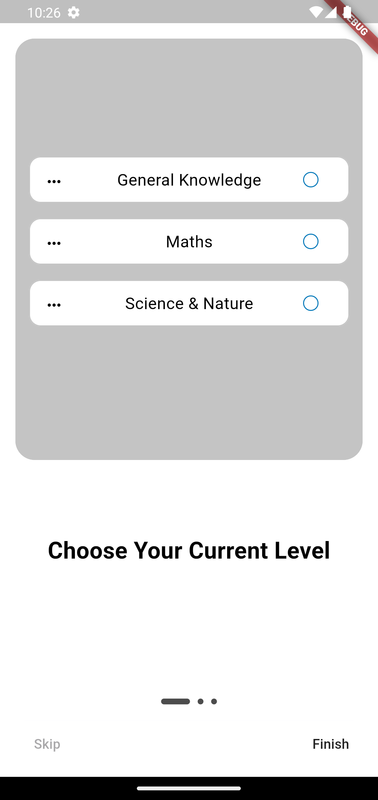
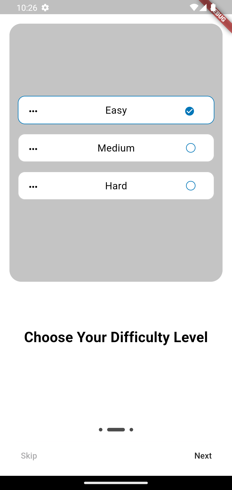
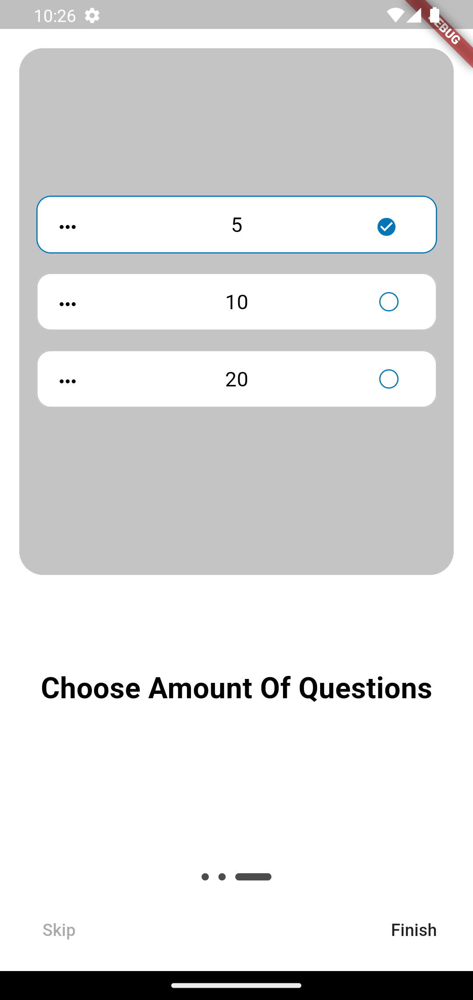
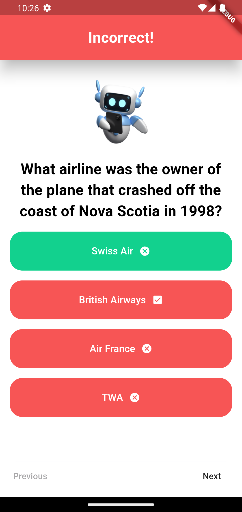
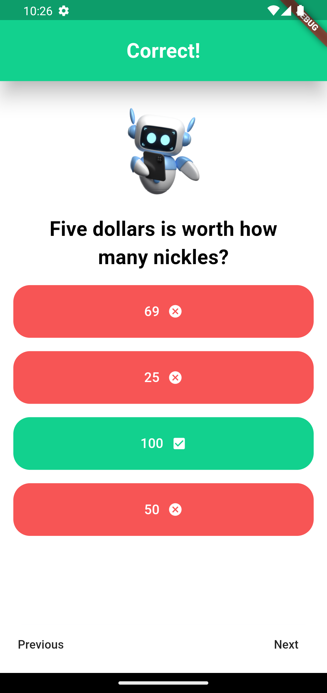
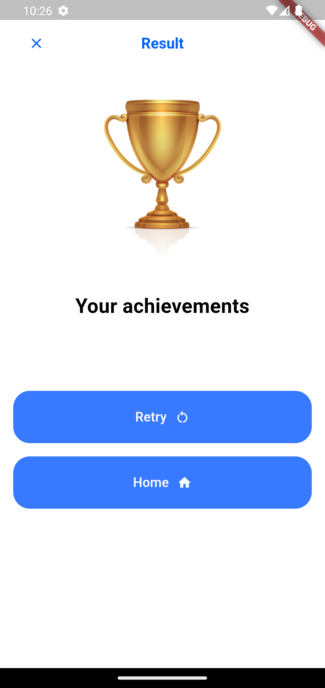
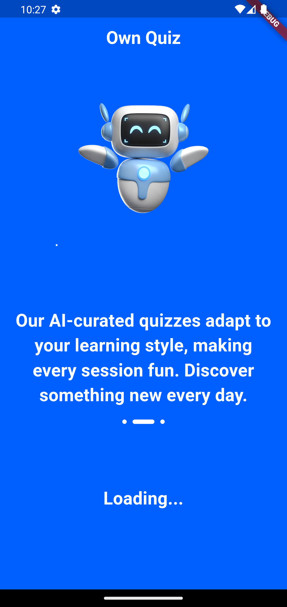

# flai_quiz

A new Flutter project.

## Getting Started

This project is a starting point for a Flutter application.

Api used:

- [API](https://opentdb.com/api.php)

## How to use

To clone and run this application, you'll need [Git](https://git-scm.com/downloads) and [Flutter](https://flutter.dev/docs/get-started/install) installed on your computer.

# Run Flutter doctor to check whether the installation was successful
```shell
flutter doctor
```

# Clone this repository
```shell
git clone https://github.com/KovIlja/flai_quiz.git
```

# Go into the repository
```shell
cd flai_quiz
```

# Install dependencies
```shell
flutter pub get
```

Connect any Android or iOS device / open emulator or simulator.

# Run the app
```shell
flutter run
```

## Screenshots

<br>









